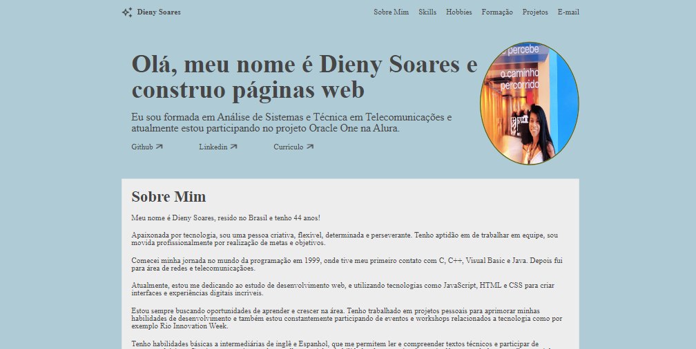
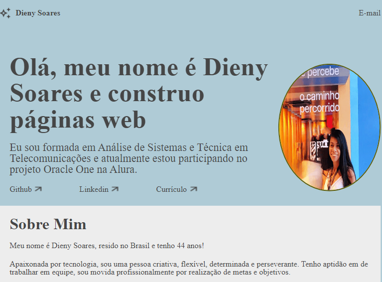

# Currículo

- Currículo Online Contendo:

- Nome
- Menu
- Apresentação Inicial
- Sobre Mim
- Skills
- Hobbies
- Formação Acadêmica
- Experiência Profissional
- Formulário de Contato
- Projeto responsivo e funcional em Computadores, Tablets e Smartphones

## Currículo no Computador

## Currículo no Tablet

## Currículo no Smartphone

Como acessar:

1 - Acesse a página da aplicação <a href="https://dyrj.github.io/portifolioDieny/">clicando aqui</a> 

Tecnologias Utilizadas:

HTML, CSS e JavaScript

https://www.linkedin.com/in/dieny-soares/

# Portifólio Dieny
